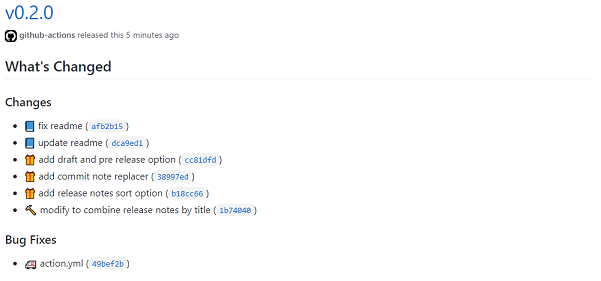

## bump-release-action
  
Bump version and publish release action

This action is bump version from latest release, publish release with changes note and push to version branch. Made it for the development of the action, but it can also be used for other purposes

Features:
- Calculate next version from latest release, Commit and PullRequest
- Create release note by Commit and PullRequest
- Publish release
- Push commits to version branch
- Change the version written in the file

## Example
<div align="center">

</div>

```yaml
# .github/workflows/release.yml:
name: Release

on:
  workflow_dispatch:
    inputs:
      bump:
        description: 'bump type, major or minor or patch or empty string'
        default: ''
      dry_run:
        description: 'dry run, true or false'
        default: 'false'
      draft:
        description: 'draft, true or false'
        default: 'false'
      pre_release:
        description: 'pre release, true or false'
        default: 'false'

jobs:
  release:
    runs-on: ubuntu-latest
    steps:
      - uses: actions/checkout@v2
        with:
          fetch-depth: 0
      - uses: actions/setup-node@v1
        with:
          node-version: 12
      - run: npm install
      - run: npm run build
      - run: npm run test
      - uses: MeilCli/bump-release-action@v1
        with:
          config_path: '.github/bump.yml'
          bump: ${{ github.event.inputs.bump }}
          dry_run: ${{ github.event.inputs.dry_run }}
          draft: ${{ github.event.inputs.draft }}
          pre_release: ${{ github.event.inputs.pre_release }}
```
You can also pin to a [specific release](https://github.com/MeilCli/bump-release-action/releases) version in the format `@v1.x.x`

```yaml
# .github/bump.yml
release:
  title-prefix: 'v'
  initial-version: '0.0.1'
  tag-prefix: 'v'
  commit-note-replacers:
    - replace-prefix: 'breaking: '
      new-prefix: ''
    - replace-prefix: 'feature: '
      new-prefix: ''
    - replace-prefix: 'change: '
      new-prefix: ''
    - replace-prefix: 'fix: '
      new-prefix: ''
    - replace-prefix: 'document: '
      new-prefix: ''
    - replace-prefix: 'dependency: '
      new-prefix: ''
branch:
  version-branch-prefix: 'v'
  bump-version-commit-prefix: 'v'
categories:
  - title: 'Breaking Changes!'
    labels:
      - 'BreakingChange'
    commits:
      - 'breaking:'
    changes-prefix: ':warning: '
  - title: 'Changes'
    labels:
      - 'Feature'
    commits:
      - 'feature:'
    changes-prefix: ':gift: '
  - title: 'Changes'
    labels:
      - Maintenance
    commits:
      - 'change:'
    changes-prefix: ':hammer: '
  - title: 'Bug Fixes'
    labels:
      - 'Bug'
    commits:
      - 'fix:'
    changes-prefix: ':ambulance: '
  - title: 'Changes'
    labels:
      - 'Documentation'
    commits:
      - 'document:'
    changes-prefix: ':blue_book: '
  - title: 'Dependency Updates'
    labels:
      - 'Dependencies'
    skip-label: 'Development'
    commits:
      - 'dependency:'
    changes-prefix: ':green_book: '
bump:
  default: 'patch'
  major:
    labels:
      - 'BreakingChange'
    commits:
      - 'breaking:'
  minor:
    labels:
      - 'Feature'
    commits:
      - 'feature:'
files:
  - file-path: 'package.json'
    line: 3
  - file-path: 'package-lock.json'
    line: 3

```

## Input
- `repository`
  - required
  - running repository, format: owner/repository
  - default: `${{ github.repository }}`
- `github_token`
  - required
  - github token, using to read and write repository
  - default: `${{ github.token }}`
- `commit_user`
  - required
  - the commit user
  - default: `github-action`
- `commit_email`
  - required
  - the commit user`s email
  - default: `41898282+github-actions[bot]@users.noreply.github.com`
- `config_path`
  - required
  - config file path
- `bump`
  - how to bump version, value: `major` or `minor` or `patch` or empty string
  - if set `major`, `minor` or `patch`, priority execute to bump version
- `dry_run`
  - if `true`, not create and push this changes, and output release informations
- `draft`
  - if `true`, create release as draft
- `pre_release`
  - if `true`, create release as pre release

## Output
- `current_version`
  - calculated current version
- `next_version`
  - calculated next version
- `release`
  - the response json of created release

## Configuration
### Overview
```yaml
release:
  title-prefix: 'v'
  title-postfix: ' Released!'
  body-title: 'Changed'
  body-when-empty-changes: 'No changes'
  initial-version: '0.0.1'
  tag-prefix: 'v'
  tag-postfix: '-stable'
  sort-by: 'note'
  sort-direction: 'ascending'
  commit-note-replacers:
    - replace-prefix: 'feature: '
      new-prefix: 'feature '
branch:
  base-branch: 'develop'
  version-branch-prefix: 'v'
  version-branch-postfix: '-stable'
  create-major-version-branch: false
  create-minor-version-branch: true
  bump-version-commit-prefix: 'v'
  bump-version-commit-postfix: '-stable'
categories:
  - title: 'Feature'
    labels:
      - 'feature'
    skip-label: 'skip'
    commits:
      - 'feature:'
    changes-prefix: '🎁'
    changes-postfix: '😊'
bump:
  default: 'minor'
  major:
    labels:
      - 'major'
    commits:
      - 'major:'
  minor:
    labels:
      - 'minor'
    commits:
      - 'minor:'
  patch:
    labels:
      - 'patch'
    commits:
      - 'patch:'
files:
  - file-path: 'version1.txt'
    line: 1
    start: 10
```

### Release
- `title-prefix`
  - prefix of release title
- `title-postfix`
  - postfix of release title
- `body-title`
  - title of release body
  - default: `What's Changed`
- `body-when-empty-changes`
  - body of release when empty changes
  - default: `This release has not changes`
- `initial-version`
  - resolved version if cannot get latest release
  - default: `1.0.0`
- `tag-prefix`
  - prefix of tag
- `tag-postfix`
  - postfix of tag
- `sort-by`
  - sort release notes by `note` or `commit_at`
  - default: `commit_at`
- `sort-direction`
  - sort release notes direction `descending` or `ascending`
  - default: `descending`
- `commit-note-replacers`
  - replacer of release note from Commit
- `commit-note-replacers.replace-prefix`
  - replace prefix string
- `commit-note-replacers.new-prefix`
  - new prefix string

### Branch
- `base-branch`
  - base branch of running this action
  - default: `master`
- `version-branch-prefix`
  - prefix of version branch name
- `version-branch-postfix`
  - postfix of version branch name
- `create-major-version-branch`
  - if `true`, create major version branch and push commit to it
  - default: `true`
  - example: 
    - published version(`1.2.3`) => major version branch(`${version-branch-prefix}1${version-branch-postfix}`)
    - published version(`1.2.3`) and prefix `v` => major version branch(`v1`)
- `create-minor-version-branch`
  - if `true`, create minor version branch and push commit to it
  - default: `false`
  - example:
    - published version(`1.2.3`) => minor version branch(`${version-branch-prefix}1.2${version-branch-postfix}`)
    - published version(`1.2.3`) and prefix `v` => minor version branch(`v1.2`)
- `bump-version-commit-prefix`
  - prefix of bump version commit
  - using only when provided `files` configurations
- `bump-version-commit-postfix`
  - postfix of bump version commit
  - using only when provided `files` configurations

### Categories
This configuration is array value, and Judgment is given priority in order from the top

- `title`
  - title of this categories
  - default: `Changes`
- `labels`
  - exact match label to determine this category
  - value: array of string
- `skip-label`
  - exact match label to determine skip
- `commits`
  - prefix match commit message to determine this category
  - value: array of string
- `changes-prefix`
  - prefix of this changes, using when release note creation
- `changes-postfix`
  - postfix of this changes, using when release note creation

### Bump
- `default`
  - default bump type
  - value: `major`, `minor` or `patch`
  - default: `patch`
- `major`
  - condition to judge as major bump
  - if it is determined, it will be executed in preference to minor bump and patch bump
- `major.labels`
  - exact match label to determine this bump
  - value: array of string
- `major.commits`
  - prefix match commit message to determine this bump
  - value: array of string
- `minor`
  - condition to judge as minor bump
  - if it is determined, it will be executed in preference to patch bump
- `minor.labels`
  - exact match label to determine this bump
  - value: array of string
- `minor.commits`
  - prefix match commit message to determine this bump
  - value: array of string
- `patch`
  - condition to judge as patch bump
- `patch.labels`
  - exact match label to determine this bump
  - value: array of string
- `patch.commits`
  - prefix match commit message to determine this bump
  - value: array of string

### Files
This configuration is array value, if provide configuration, commit version up and push commit to base branch

- `file-path`
  - file that want version up
- `line`
  - number of lines containing the version want to version up
- `start`
  - start of line containing the version want to version up
  - optional
  - note: use when contained multiple version in single line

## License
MIT License

### Using
- [actions/toolkit](https://github.com/actions/toolkit), published by [MIT License](https://github.com/actions/toolkit/blob/master/LICENSE.md)
- [nodeca/js-yaml](https://github.com/nodeca/js-yaml), published by [MIT License](https://github.com/nodeca/js-yaml/blob/master/LICENSE)
- [npm/node-semver](https://github.com/npm/node-semver), published by [ISC License](https://github.com/npm/node-semver/blob/master/LICENSE)
