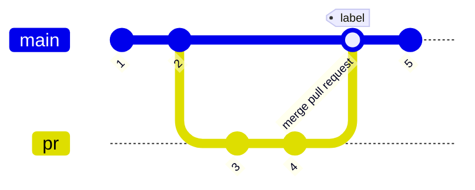

# Commit calculating strategy

Pull request can recieved from other owner repository. In that case, we want not decided release note and version by others.  
So, default strategy is exclude pull request commit.

## Option
This option is set by `release: pull-request-commit:`

### `exclude`(default)

### `include`

### `include_merge_commit_only`

### `include_branch_commit_only`

